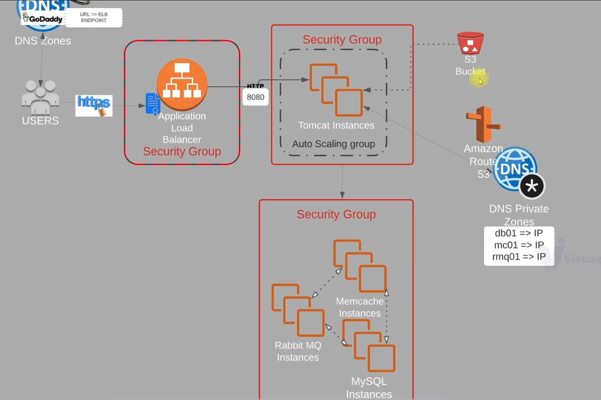

# AWS Lift & Shift Deployment – VProfile Application

## Overview
This repository demonstrates a real-world **Lift & Shift migration** of a multi-tier Java web application (**VProfile**) from a traditional VM-based environment to **AWS Cloud (IaaS)**.

The objective of this project is to modernize infrastructure **without changing application code**, while achieving:
- High availability
- Scalability
- Secure networking
- Automation using EC2 User Data
- Production-ready architecture

This project reflects how legacy enterprise workloads are commonly migrated to AWS.

---

## Architecture


### Application Flow
1. Users access the application using a public domain.
2. Traffic is routed to an **Application Load Balancer (HTTPS)**.
3. ALB forwards traffic to **Tomcat EC2 instances** in an Auto Scaling Group.
4. Application communicates with backend services via **private DNS**:
   - MySQL (Database)
   - Memcache (Caching)
   - RabbitMQ (Message Broker)

Execution steps are documented here:
[Execution Flow](architecture/execution-flow.md)


---

## AWS Services Used

| Service | Purpose |
|------|------|
| EC2 | Application & backend services |
| Application Load Balancer | Traffic distribution |
| Auto Scaling Group | Elastic scaling for Tomcat |
| S3 | Application artifact storage |
| Route 53 | Private DNS resolution |
| ACM | HTTPS certificates |
| Security Groups | Network isolation |

---

## Repository Structure
```
vprofile-aws-lift-and-shift/
│
├── README.md
│
├── architecture/
│   ├── aws-lift-shift-architecture.png
│   └── execution-flow.md
│
├── userdata-scripts/
│   ├── tomcat-userdata.sh
│   ├── mysql-userdata.sh
│   ├── memcache-userdata.sh
│   ├── rabbitmq-userdata.sh
│   └── nginx-userdata.sh
│
├── dns-route53/
│   └── private-zone-mapping.md
│
├── load-balancer/
│   └── alb-https-setup.md
│
├── autoscaling/
│   └── tomcat-asg.md
│
├── s3-artifacts/
│   └── artifact-upload-download.md
│
├── security/
│   └── security-groups-design.md
│
└── screenshots/
    ├── app-login.png
    ├── app-home.png
    ├── cache-hit.png
    ├── cache-miss.png
    └── rabbitmq.png
```

---

## Automation Strategy

All EC2 instances are provisioned using **Bash user-data scripts**, enabling:
- Zero manual server configuration
- Repeatable deployments
- Faster scaling and recovery

Each backend component has a dedicated script.

---

## Application Validation

The application was validated with:
- Successful login and navigation
- Cache miss → DB read → cache insert
- Cache hit on subsequent requests
- RabbitMQ initialization with queues and exchanges

Screenshots are included for **application-level validation**.

---

## Why This Project Matters

This project demonstrates:
- Real enterprise cloud migration patterns
- Infrastructure design decisions
- Security and network isolation
- Automation mindset
- Cloud-native scalability without refactoring

---

## Possible Enhancements
- Terraform-based provisioning
- Ansible configuration management
- CI/CD pipeline for artifact deployment
- CloudWatch monitoring and alarms

---

## Author
DevOps Portfolio Project  
AWS | Linux | Bash | Cloud Architecture
